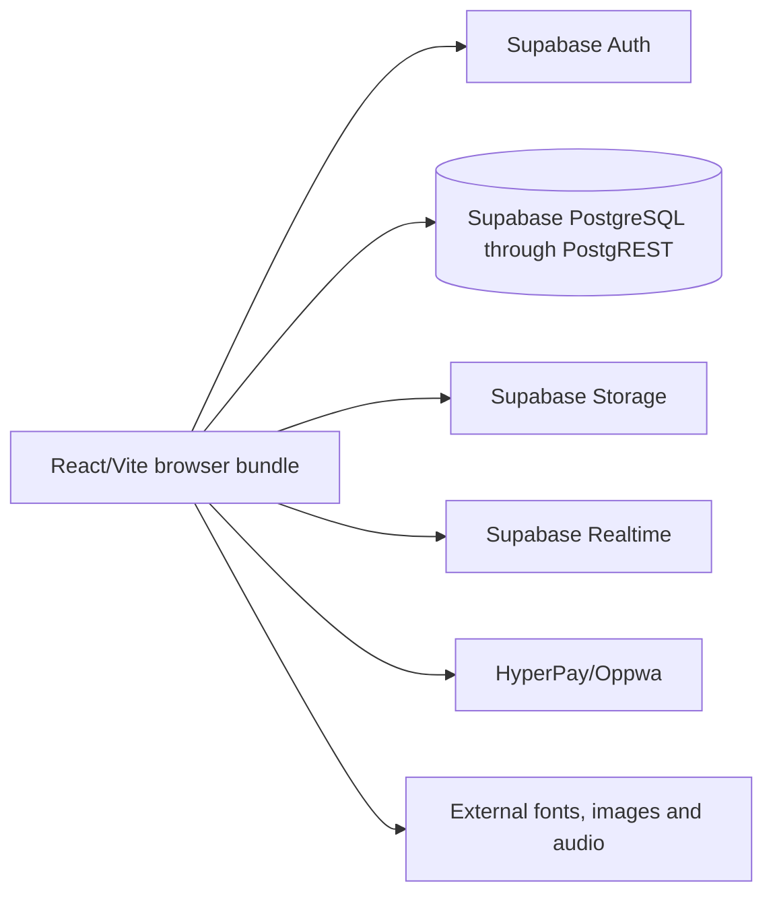

# SA Hall production handover audit

Audit date: 2026-10-07
Audited revision: `94749994` (`main`)
Current implementation: Vite 5 + React 18 + direct Supabase browser client
Audit status: source audit complete; live Supabase schema/data and production infrastructure were not available

## Executive summary

SA Hall is an Arabic-first marketplace and operations application for event halls, chalets, related services, bookings, subscriptions, coupons, a platform store, vendor point of sale, accounting, content management, and administration. It has three effective roles: `super_admin`, `vendor`, and `user`/guest.

The repository is not a Next.js application. It is a single Vite/React bundle with no application backend. Browser components call Supabase tables, Auth, Realtime, and Storage directly. Payment preparation and verification are also performed in the browser. The codebase contains roughly 30,384 lines of TypeScript/TSX/CSS/SQL, including 30+ screens and more than 60 unordered SQL repair scripts.

The legacy frontend builds, but it is not production safe. The reproduced build emits one 1,411.90 kB minified JavaScript bundle (347.02 kB gzip), has no automated tests or lint command, and its installed dependency tree reports 21 known vulnerabilities (1 critical, 14 high, 5 moderate, 1 low; production-only audit: 1 critical, 2 high, 2 moderate). There are confirmed authentication, payment, authorization, XSS, race-condition, and migration-control defects.

Production deployment should be blocked until the critical findings below are remediated. Existing production data must be exported and profiled before a database cutover.

## System map

### Users and primary workflows

| Actor | Current workflows |
| --- | --- |
| Public visitor | Home/CMS content, browse halls and services, view hall/chalet/service details, platform store, legal pages |
| Guest/customer | Phone or email OTP login, create hall/chalet/service bookings, choose package/add-ons, pay, view booking history and orders, favorites |
| Vendor | Registration and approval, subscription payment, halls/chalets/services, bookings/calendar, coupons, clients, brand settings, marketplace/store orders, POS, invoices, expenses and accounting |
| Super admin | Dashboard, users/subscribers, halls/services and featured placement, coupons, subscriptions, accounting, store, CMS/announcements/legal content, homepage sections, upgrade requests, platform/payment settings |

### Current runtime architecture

There is no trusted application boundary between the browser and money-, identity-, or authorization-sensitive operations.

### Navigation inventory

The application uses a string/hash state machine in `App.tsx`, not a router. Public routes include home, hall/service browsing and detail views, store, and legal content. Auth routes include vendor login/registration, guest login, password reset, pending approval, vendor activity selection, and subscription. Protected-looking strings include vendor dashboard, halls/chalets/services, bookings/calendar, coupons, clients, accounting, marketplace, brand settings, and the full admin area. Several admin cases render without checking `userProfile.role`.

### Data and integrations

SQL files define or mutate at least the following tables: `profiles`, `halls`, `chalets`, `services`, `bookings`, `blocked_dates`, `hall_night_packages`, `coupons`, `reviews`, `user_favorites`, `vendor_clients`, `subscriptions`, `vendor_subscriptions`, `subscription_alerts`, `upgrade_requests`, `featured_halls`, `featured_services`, `hall_visibility`, `service_categories`, `home_page_sections`, `content_pages`, `legal_pages`, `popup_announcements`, `notifications`, `pos_items`, `store_categories`, `store_orders`, `invoices`, `external_invoices`, `expenses`, `payment_logs`, `zakat_calculations`, `system_settings`, and `audit_logs`.

Storage buckets referenced are `hall-images`, `service-images`, and `vendor-logos`. External integrations are Supabase, HyperPay/Oppwa, Google Fonts, remote image hosts, WhatsApp deep links, and externally hosted notification sounds. No email provider, job runner, queue, backup job, or production observability integration exists in the repository.

## Findings

### CRITICAL

#### C-01 — Payment credentials and payment operations execute in the browser

`services/paymentService.ts` reads `hyperpay_access_token` and `hyperpay_entity_id` from the publicly readable `system_settings` row, then sends the bearer token from the browser directly to HyperPay. SQL explicitly allows public reads of all `system_settings`. Any visitor can retrieve the gateway token. The browser also supplies the amount, merchant transaction ID, and customer data.

Impact: credential theft, fraudulent or malformed transactions, replay, amount tampering, gateway account compromise, and leakage through browser tooling/logging.

Required remediation: rotate the token immediately; remove payment secrets from JSON settings; store secrets only in backend environment/secret storage; create and verify checkouts server-side; calculate amounts from authoritative database records; use a signed, idempotent webhook as the source of truth.

#### C-02 — Payment success is trusted from URL query parameters

`pages/PaymentCallback.tsx` accepts `status=SUCCESS` or `status=OK` and an attacker-controlled booking identifier, then updates the booking to `confirmed`/`paid` without server-to-server verification. Failure also writes `payment_status = 'failed'`, a value that conflicts with the TypeScript and SQL status sets found elsewhere.

Impact: unauthorized booking confirmation or cancellation and irreconcilable payment state.

Required remediation: make the callback display-only; verify the resource path server-side; persist a unique provider transaction; reject amount/currency/reference mismatches; use idempotent state transitions and a webhook reconciliation job.

#### C-03 — Universal static SMS OTP is enabled

`services/smsService.ts` has `TESTING_MODE = true` and accepts `222222` for every phone. `GuestLogin.tsx` discloses the code in the success message. OTP state lives only in browser memory/local storage and the fallback generator uses `Math.random()`.

Impact: trivial impersonation of any phone-based guest, unauthorized access to booking history, and account creation under another phone number.

Required remediation: disable/remove the client implementation; move OTP issuance and verification to the backend/provider; hash short-lived challenges; add attempt limits, resend cooldowns, generic responses, rate limits, audit events, and credential-stuffing protections.

#### C-04 — There is no trusted backend authorization boundary

All data access and mutations originate in the browser. Admin screen cases such as `admin_dashboard`, `admin_users`, `settings`, `admin_cms`, and `admin_store` render without a role guard. Vendor screens generally check only that a profile exists, not that it is a vendor or owns the resource. Database policy correctness is therefore the only barrier, while the repository contains many conflicting policies.

Impact: IDOR, horizontal/vertical privilege escalation, mass assignment, and administrative data exposure if any effective RLS policy is permissive or stale.

Required remediation: introduce NestJS; enforce authentication, role and ownership policies for every command/query; keep Angular guards only for UX; add authorization integration tests for every role/resource pair.

#### C-05 — Client-provided booking price and anonymous insert policies are authoritative

The browser writes `vendor_id`, totals, VAT, discounts, package snapshots, booking status and payment fields. Multiple scripts create anonymous booking policies with `WITH CHECK (true)`. There is no atomic availability check or exclusion/unique constraint preventing overlapping bookings.

Impact: arbitrary prices/discounts/vendor assignment, forged bookings, overbooking, spam, and revenue loss.

Required remediation: calculate all monetary values server-side; validate package/coupon validity and ownership; lock/check availability in one transaction; add the appropriate PostgreSQL exclusion or unique invariant; rate-limit guest creation.

#### C-06 — Stored XSS through CMS/legal content

`pages/LegalPage.tsx` renders database content using `dangerouslySetInnerHTML` without sanitization. CMS fields also control external URLs and image sources.

Impact: persistent script execution for public visitors or authenticated administrators, token/session theft, phishing, and malicious redirects.

Required remediation: store a constrained document format or sanitize on write and render with a current allowlist sanitizer; validate URL protocols/domains; add Content Security Policy and regression tests.

### HIGH

#### H-01 — Database state is not reproducible

The root contains more than 60 ad-hoc SQL setup/fix files with no migration tool, sequence, checksum, or single canonical schema. Scripts redefine the same tables, constraints, triggers, and policies. Examples include incompatible `booking_type` and `payment_status` checks, multiple subscription tables, and repeated/drop-and-recreate RLS policies.

Impact: clean deployments cannot be reproduced; production schema may differ from source; rollback and disaster recovery are unsafe.

Remediation: introspect and dump the live schema, classify each script as applied/superseded, establish a baseline migration, then use ordered transactional migrations with a schema history table.

#### H-02 — Public profile and configuration data are overexposed

`profiles` is configured with public `SELECT USING (true)` and screens select entire related vendor profiles. `system_settings` is entirely public although it contains payment gateway settings and operational configuration.

Impact: PII/business data and secrets can be enumerated.

Remediation: publish narrow public views/DTOs; keep private profile/config columns server-only; verify column-level API responses.

#### H-03 — Role is sourced from mutable user metadata in at least one admin policy

`database/legacy/db_full_schema.sql` authorizes admins from JWT `user_metadata.role`; user metadata is not an appropriate trusted authorization claim. Later scripts sometimes query `profiles`, but migration order is unknown.

Impact: possible privilege escalation depending on effective Supabase configuration/policies.

Remediation: use server-managed claims or backend/database authorization derived from immutable role assignments; revoke the metadata-based policy.

#### H-04 — Store checkout and inventory updates are non-transactional

The client inserts an order and then decrements each item independently using values previously read by the browser. Concurrent buyers can oversell; partial failures leave inconsistent stock/order state; clients can submit arbitrary prices and quantities.

Remediation: server-side transactional checkout with row locking, non-negative stock constraint, server pricing and idempotency key.

#### H-05 — Account and profile creation has unsafe self-healing paths

The browser inserts missing profiles using values from user metadata, including role. `UsersManagement.tsx` creates profile-like records with random UUIDs without corresponding auth identities. The auth trigger catches all errors and silently returns, creating split-brain identities.

Remediation: create identities and profiles only in a backend transaction/controlled admin workflow; make trigger failures visible; reconcile orphaned records.

#### H-06 — Upload controls are incomplete

Uploads are sent directly to public Supabase buckets. There is no demonstrated server-side MIME sniffing, size/dimension limits, malware scanning, image re-encoding, quota enforcement, or lifecycle policy. Filename construction and ownership policies differ by bucket.

Remediation: issue scoped upload intents or proxy uploads through the backend; inspect magic bytes; limit size/count; randomize object keys; re-encode images; keep private originals where appropriate.

#### H-07 — No automated test safety net

There are no unit, integration, API, E2E, authorization, migration, or load tests, and no CI configuration. Many markdown files say features are complete without executable evidence.

Remediation: build a characterization suite before retiring each legacy slice and add CI gates for format, lint, unit, integration, E2E, build, migration and image/container scans.

#### H-08 — Known vulnerable dependencies

`npm ci` reports 21 vulnerabilities. Production dependencies include vulnerable `dompurify` through `jspdf`, `lodash`, `ws`, and `fflate`; the production-only audit reports one critical vulnerability.

Remediation: migrate to maintained versions, remove unused PDF/browser dependencies where possible, run audit/SBOM/container scanning in CI, and document accepted residual risk.

### MEDIUM

#### M-01 — Monolithic routing and bundle

`App.tsx` is 775 lines and eagerly imports essentially every screen. The production build produces a 1.41 MB minified main JS chunk. There is no route-level splitting.

#### M-02 — Unbounded queries and browser-side aggregation

Many screens call `select('*')` without pagination and compute dashboards/counts/client lists in memory. This will degrade rapidly and may expose unnecessary columns. Admin screens issue multiple independent queries per view.

#### M-03 — Query/index mismatch and likely N+1 growth

Frequent access patterns include bookings by vendor/date/status, public assets by active/city/type, orders by buyer/status/date, notifications by user/read/date, and active featured ranges. The SQL history has some single-column indexes but no verified query plans or complete composite/index strategy.

#### M-04 — Validation is mostly presentational

Forms use ad-hoc state and partial checks. Many mutations spread entire objects into update payloads. Enum, range, URL, pagination, sorting, ownership and state-transition validation are not centralized or server-enforced.

#### M-05 — State transitions are inconsistent

Booking/payment/subscription statuses differ between TypeScript, UI writes, and SQL checks. Some flows create an active asset before successful subscription payment; registration writes a hard-coded hall price; comments and redirect behavior conflict.

#### M-06 — Race conditions and duplicate operations

Availability is read before insert without a lock, subscriptions and assets are created in separate client calls, stock uses read-modify-write, and profile creation is retried in multiple places. No idempotency keys exist for payments or writes.

#### M-07 — Error handling and logging leak internals

Raw provider/database messages are surfaced or logged; phone numbers and OTP flow details are logged; there is no correlation ID, structured log schema, redaction, centralized exception filter, or user-safe error contract.

#### M-08 — Navigation is not URL-safe or accessible

Important detail state exists only in memory; refresh/deep link/back behavior is fragile; hash formats are inconsistent. Route changes do not manage focus. Authorization and preload/resolvers cannot be expressed cleanly.

#### M-09 — UI accessibility and RTL quality are inconsistent

The document is Arabic/RTL, but controls frequently rely on small icon-only buttons without accessible names, manual left/right placement, low-contrast tiny labels, and hover-only feedback. Data-heavy pages are card-heavy and not consistently keyboard operable.

#### M-10 — Production asset supply is brittle

Core branding, fonts, sounds, demo avatars and imagery rely on third-party hosts. Several production paths contain placeholder/example URLs and hard-coded demo images. CSP/SRI and failure fallbacks are absent.

#### M-11 — No observability or operational endpoints

There are no liveness/readiness endpoints, metrics, request IDs, structured logs, alerting, graceful shutdown evidence, or dependency health checks.

#### M-12 — No containerized/reproducible deployment

There is no Dockerfile or Compose stack. The README is an untouched AI Studio template and asks for an unrelated Gemini key. No backup/restore or release procedure exists.

### LOW

#### L-01 — Type safety is weakened

The project uses many `any` values, allows JavaScript, skips library checking, has no linting/formatting gate, and mixes database shapes with UI view models.

#### L-02 — Dead/unfinished or misleading code

There are unused payment modal states/imports, placeholder upload boxes, fake/random admin dashboard metrics, duplicated registration/auth flows, stale completion documents, and many console statements.

#### L-03 — Visual language is inconsistent

Large radii, shadows, gradients/remote imagery, excessive cards and one-off colors conflict with the requested zero-elevation Material 3 direction.

#### L-04 — Repository hygiene

`.env` is tracked despite `.gitignore`; it contains a literal Supabase URL and anon token. An anon token is designed for browser use but should still be treated as deploy-time configuration and rotated if policy history made it unsafe. Git history must be scanned before public distribution.

## Current verification baseline

| Check | Result |
| --- | --- |
| Legacy install | Pass with `npm ci`; 21 vulnerabilities reported |
| Legacy TypeScript + production build | Pass |
| Legacy main JS | 1,411.90 kB minified / 347.02 kB gzip |
| Legacy CSS | 91.14 kB minified / 14.68 kB gzip |
| Unit/integration/E2E tests | Not present |
| Lint | Not configured |
| Clean database bootstrap | Not reproducible from an ordered migration set |
| Live schema/data validation | Blocked: no database dump/connection supplied |
| Payment/OTP safe for production | Fail |

## Immediate containment actions

1. Disable payment initiation and payment-state mutation in the legacy browser until the gateway credential is rotated and backend verification exists.
2. Disable the static OTP path and invalidate sessions created through it if audit data allows identification.
3. Restrict `system_settings` and private profile columns immediately in the live database.
4. Review the effective—not merely source—RLS policies from the live catalog and revoke permissive write policies.
5. Export and encrypt a database/schema/storage backup before any migration.
6. Freeze ad-hoc SQL execution; all further schema changes must be versioned.
7. Put the current deployment behind rate limits and add temporary monitoring for payment, OTP, admin and booking anomalies.

## Audit limitations and evidence still required

- Production Supabase schema dump, applied policy catalog, row counts, database size and query statistics
- Supabase Auth settings, SMS/email provider settings and auth audit logs
- HyperPay merchant configuration and webhook history
- Current hosting/CDN/DNS/TLS configuration and access logs
- Production environment variable inventory (names and ownership, never values in documents)
- Storage object counts/sizes and access policy catalog
- A sanitized production data sample for migration rehearsal

These are not optional for final cutover. Source SQL alone cannot prove the live database state.
