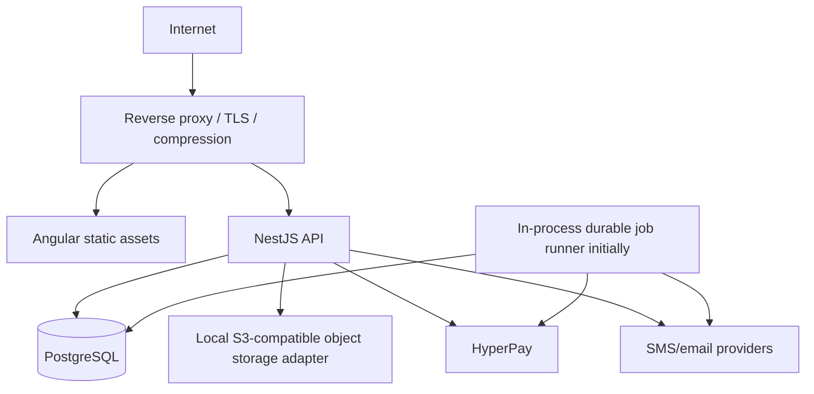

# SA Hall target architecture

Status: approved implementation baseline
Target frontend: Angular 22.2.x + Angular Material 22.2.x
Target backend: NestJS 12 modular monolith
Target database: PostgreSQL 18 container for the initial single-VPS deployment

## Architecture principles

- Preserve business behavior intentionally; do not reproduce security flaws or inconsistent state transitions.
- Keep one deployable API modular monolith until measured boundaries justify extraction.
- Make the API stateless. Persist sessions, idempotency, jobs and rate-limit coordination in external stores only when required.
- Treat the backend as the sole authority for identity, authorization, pricing, availability, payment state and inventory.
- Keep domain rules independent from Angular, HTTP controllers and SQL.
- Use versioned migrations and compatibility views/import tooling to preserve current production data.
- Make public reads cacheable, authenticated writes auditable, and all list endpoints paginated.

## Repository layout

```text
apps/
  web/                  Angular application
  api/                  NestJS modular monolith
packages/
  contracts/            Framework-neutral DTO schemas and generated OpenAPI types
infra/
  docker/               Production Dockerfiles and proxy configuration
tests/
  load/                 k6 scenarios
docs/
  decisions/            Architecture decision records
  runbooks/             Backup, restore, deploy, incident and rollback procedures
legacy/                 React application after the first safe move; retained until parity
```

The legacy code remains operational during migration. Moving it under `legacy/` is deferred until workspace scripts and deployment routing are in place, avoiding a destructive first step.

## Runtime topology



Initial Compose services are `web`, `api`, `postgres`, and `proxy`. Redis is deliberately excluded until distributed rate limiting, queues, locks or cache measurements justify it. Uploads use an object-storage interface; the single-VPS implementation may use a persistent volume, with an S3-compatible provider as the scale-out target.

## Backend module boundaries

| Module | Responsibility |
| --- | --- |
| Identity | Password/OTP authentication, refresh-session rotation, password reset, account lockout |
| Access | Roles, permissions, ownership policies and admin elevation audit |
| Profiles | Private user/vendor data and narrow public vendor projection |
| Catalog | Halls, chalets, services, amenities, packages, media and public search |
| Availability | Blocked dates, capacity, availability queries and transactional reservation |
| Bookings | Booking aggregate, lifecycle, guest access and cancellation policies |
| Pricing | VAT, packages, add-ons, seasonal prices, coupons and immutable quote snapshots |
| Payments | Checkout intents, provider verification, webhook inbox, reconciliation and refunds |
| Subscriptions | Vendor plans, entitlements, asset limits, renewals and upgrade requests |
| Commerce | Products, inventory, carts, orders and fulfillment |
| CRM | Vendor clients and customer history projections |
| Finance | Invoices, payment logs, expenses, VAT/zakat projections and exports |
| Content | Homepage sections, announcements, legal pages and safe rich content |
| Notifications | Notification inbox and provider delivery attempts |
| Media | Upload policy, MIME inspection, transforms, ownership and object keys |
| Administration | Moderation, feature placement, system configuration and audited commands |
| Operations | Health/readiness, metrics, audit log, background jobs and outbox |

Each module follows `presentation -> application -> domain <- infrastructure`. Controllers depend on use cases; use cases depend on ports/repositories; database adapters implement those ports. Cross-module changes use explicit application services and transactions, not direct table access from unrelated modules.

## API contract

- REST JSON under `/api/v1`; generated OpenAPI at a protected/non-production documentation route.
- Request/response DTOs are explicit. Database rows never leave repositories directly.
- Consistent envelope for errors using a stable code, Arabic user message, field errors, request ID and optional retry hint.
- Cursor pagination for high-volume timelines; bounded offset pagination for admin tables where page jumps are required.
- Allowlisted sorting/filtering only; default/max page sizes are enforced.
- `Idempotency-Key` is mandatory for payment, booking, subscription and order commands.
- Optimistic version columns protect editable aggregates; transactional locks protect inventory and availability.

Example error:

```json
{
  "statusCode": 422,
  "code": "BOOKING_DATE_UNAVAILABLE",
  "message": "التاريخ المحدد غير متاح.",
  "fieldErrors": [{ "field": "bookingDate", "message": "اختر تاريخاً آخر." }],
  "requestId": "01J..."
}
```

## Authentication and authorization

- Passwords use Argon2id with calibrated parameters.
- Short-lived access tokens are held in memory by Angular; rotating refresh sessions use `HttpOnly`, `Secure`, `SameSite=Lax` cookies and server-side hashed token records.
- OTP challenges are server-generated with a CSPRNG, hashed at rest, expire quickly, and enforce destination/IP/device attempt and resend limits.
- CSRF protection applies to cookie-authenticated state changes; origins and content types are allowlisted.
- Permissions are enforced in Nest guards/policies and repeated as ownership predicates in repositories. Angular guards control navigation only.
- Admin elevation and sensitive configuration changes require recent authentication and immutable audit records.
- Public endpoints expose public DTOs, never complete profiles or configuration rows.

## Core data design

The migration retains existing UUID identifiers. Major invariants:

- Monetary values use integer minor units (`bigint`) plus ISO currency, never floating point.
- Timestamps are `timestamptz`; business dates are `date`; times have an explicit venue timezone policy.
- Booking target is modeled explicitly and constrained to one asset.
- Booking quotes and line items are immutable snapshots.
- Payment transactions have unique provider IDs and state-machine constraints.
- Active reservation overlap is prevented transactionally, preferably with a PostgreSQL exclusion constraint over asset/date range and qualifying statuses.
- Inventory cannot become negative and is updated under row locks.
- Unique constraints cover favorites, coupon scope/code where required, idempotency keys, provider event IDs, invoice numbers and one profile per identity.
- Soft deletion is used only where legal/audit recovery requires it; public queries filter lifecycle status explicitly.

Recommended access-pattern indexes include:

- assets: `(status, city, type, id)` and vendor management `(vendor_id, status, created_at desc)`
- bookings: `(vendor_id, booking_date, status)`, `(user_id, created_at desc)`, guest lookup on normalized phone/email only through authorized paths
- notifications: `(user_id, is_read, created_at desc)`
- orders: `(buyer_id, status, created_at desc)` and fulfillment `(status, created_at)`
- featured placements: partial/range index for active display windows
- coupons: `(vendor_id, normalized_code)` plus active date filtering

Exact indexes require `EXPLAIN (ANALYZE, BUFFERS)` against production-like data before finalization.

## Angular application architecture

- Standalone components and functional providers/guards/interceptors.
- Lazy feature routes: public catalog, auth, customer portal, vendor portal, admin portal.
- Signals for local/view state; RxJS for cancellation, streams and server interaction; no global mutable god-store.
- Typed reactive forms with reusable Arabic validation messages.
- Generated API client from OpenAPI or shared framework-neutral contract schemas.
- One shell per audience: public, customer, vendor and admin; adaptive navigation uses bottom navigation only for small-screen top-level customer destinations and a rail/drawer for larger operational views.
- Route resolvers use identifiers, not in-memory objects, preserving deep links and refresh.
- Central interceptors add auth/request context and map safe API errors; feature services own caching/deduplication.
- Route title/focus restoration, skip link, keyboard operation, visible focus and live announcements are mandatory.

## Material 3 design system

The UI is Arabic-first and `dir="rtl"` at the document root. Direction is a runtime locale concern so future LTR locales do not require component rewrites.

- Seed: `#6750A4`; semantic tokens are generated from a contrast-checked violet tonal palette.
- Typography: Arabic-capable local/self-hosted font, minimum 16 px body on mobile, tabular figures for money/data.
- Spacing: 4 px base with 8/12/16/24/32/48 roles.
- Elevation: zero for normal surfaces. Hierarchy comes from surface tones, whitespace and typography; overlays may use a scrim and minimal prescribed elevation.
- Touch targets: at least 48 x 48 CSS px with 8 px separation.
- Motion: 150–300 ms, transform/opacity only, meaningful and disabled/reduced under `prefers-reduced-motion`.
- Data-heavy admin views use responsive tables, column priority, filters and action menus rather than card grids.
- Mixed Arabic/Latin values (`email`, phone, IDs, currency) receive intentional direction isolation with `dir="ltr"`/`bdi` without reversing the surrounding layout.

The persistent token and component rules live in `design-system/MASTER.md`.

## Security controls

- Global validation with allowlisting/transform disabled unless explicitly safe; request body and upload limits.
- Helmet-style headers: CSP with nonces/hashes, HSTS at proxy, `nosniff`, strict referrer and permissions policies, frame denial.
- Exact CORS origin list; credentials only where required.
- Tiered rate limits for public reads, auth, OTP, booking/payment and administration.
- Output encoding by default; constrained CMS schema/sanitization for rich content.
- SSRF-safe outbound HTTP client: allowlisted HTTPS destinations, DNS/IP checks, timeout, size cap and no arbitrary redirects.
- Upload MIME magic-byte validation, image re-encoding, randomized keys, quotas and malware hook.
- Secret values exist only in runtime secret mounts/environment; no secret is stored in public configuration tables or logs.
- Structured audit trail for identity, role, money, booking, content and configuration changes.
- Automated dependency, secret, SAST and container scans in CI.

## Performance and scalability

- Angular route splitting and budgets enforce a small public entry bundle; heavy charts/PDF tooling load only in finance routes.
- Static assets use immutable fingerprint caching and Brotli/gzip; HTML is no-cache/revalidated.
- Public catalog endpoints support CDN caching with safe cache keys and invalidation/versioning.
- API instances keep no local session/business state and shut down gracefully.
- PostgreSQL uses bounded connection pools; deployment capacity keeps total possible connections below the database limit.
- Background work uses a transactional outbox. A database-backed runner is acceptable initially; it can later move to a queue without changing domain commands.
- Metrics define latency/error/queue/database saturation SLOs before cache or Redis decisions.

## Observability

- JSON logs with timestamp, level, service, environment, request ID, route template, latency, outcome and safe actor/resource identifiers.
- Incoming `X-Request-ID` is validated or replaced; the ID is returned to clients and propagated to provider calls/jobs.
- `/health/live` checks process responsiveness only; `/health/ready` checks required dependencies with short timeouts.
- Prometheus-compatible metrics for HTTP, event loop, memory, database pool/query latency, auth, booking/payment/order outcomes and job lag.
- Stack traces remain in protected logs, never API responses. PII, tokens, passwords, OTPs and payment credentials are redacted.

## Deployment and scale-out path

Single VPS is an operational starting point, not high availability. Compose keeps PostgreSQL on an internal network and exposes only the proxy. Persistent volumes store database and initial object data. Backups are encrypted, pushed off-host and restore-tested.

Scale-out sequence based on measurements:

1. Put static assets/media behind a CDN and move objects to S3-compatible storage.
2. Run multiple stateless API replicas behind a load balancer.
3. Move jobs/rate limits to managed Redis/queue only when coordination is required.
4. Use managed PostgreSQL, connection proxying and read replicas for proven read pressure.
5. Split a service only if independent scaling, failure isolation or team ownership clearly outweighs distributed-system cost.

## Architecture decisions requiring production evidence

- Final authentication migration technique from Supabase identities
- Actual booking overlap semantics (whole-day versus timed intervals and holds)
- HyperPay webhook/signature/reconciliation contract and refund rules
- Object storage retention, privacy and regional/data residency requirements
- Saudi invoicing/ZATCA, VAT and personal-data obligations applicable to the operating entity
- RPO/RTO and backup retention targets

These decisions must be resolved before the relevant cutover, not guessed in code.
